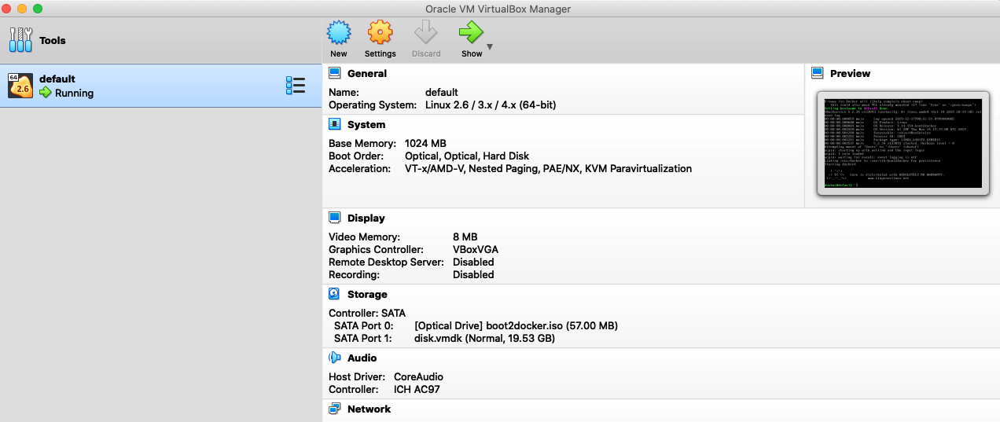
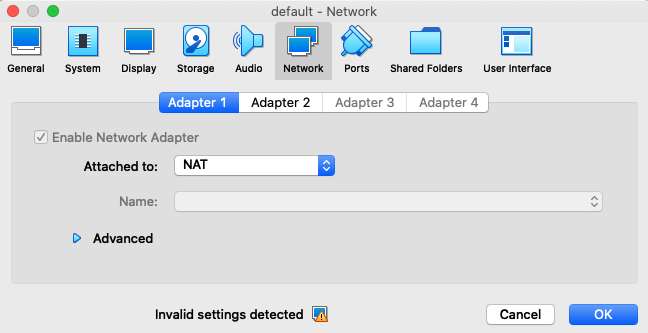
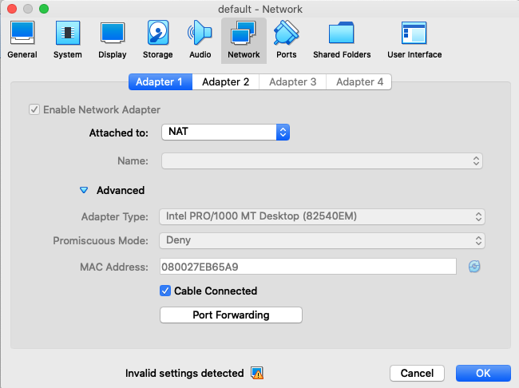
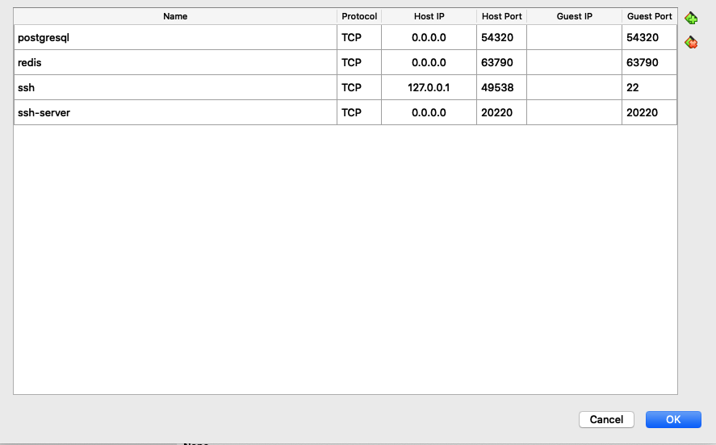

# PSE-engine

This is an engine to collect the data of products of many e-commerce sites.

Installation guide 

Docker installation

1. Install docker
    1. Mac
        <pre>
        $ brew install docker
        $ brew install docker-machine
        $ brew cask install virtualbox
        $ docker-machine create --driver virtualbox default
        </pre>
        Open the virtualbox and click the settings of the default
        
        
        
        Open the network setting
        
        

        Click the "Advanced" button
        
        
        
        Click the "Port Forwarding" button and add port forwarding rules
        
        

        <pre>
        $ docker-machine start default
        $ eval $(docker-machine env default) 
        </pre>
        
2. Run a pse image as a container
    <pre>
    $ docker run -d --cap-add=NET_ADMIN -P -p 54320:5432 -p 20220:22 -p 63790:6379 --name pse -it pse bash
    $ docker container start pse
    $ docker exec -it pse bash
    In docker pse: 
        $ su pse
        $ cd /home/pse/PSE-engine
        $ sudo service redis-server start
        $ sudo service postgresql start
    </pre>
    Now go to the setup guide

3. How to make image from ubuntu 16.04
    <pre>
    $ docker pull ubuntu:16.04
    $ docker run -d --cap-add=NET_ADMIN -P -p 54320:5432 -p 20220:22 -p 63790:6379 --name pse -it ubuntu bash
    $ adduser pse
    $ apt-get install sudo
    $ usermod -aG sudo pse
    $ su pse
    $ echo "export LC_ALL=C.UTF-8" >> ~/.bash_profile
    $ echo "export LANG=C.UTF-8" >> ~/.bash_profile
    $ sudo apt-get install vim
    $ sudo apt-get install zip 
    </pre>
    Now go to the installation guide

Manual installation

1. Install python
    1. Ubuntu
        <pre>
        $ sudo apt-get install -y make build-essential libssl-dev zlib1g-dev libbz2-dev libreadline-dev libsqlite3-dev wget curl llvm libncurses5-dev libncursesw5-dev xz-utils tk-dev
        $ git clone https://github.com/pyenv/pyenv.git ~/.pyenv
        $ echo 'export PYENV_ROOT="$HOME/.pyenv"' >> ~/.bash_profile
        $ echo 'export PATH="$PYENV_ROOT/bin:$PATH"' >> ~/.bash_profile
        $ echo 'eval "$(pyenv init -)"' >> ~/.bash_profile
        $ source ~/.bash_profile
        $ pyenv versions
        $ pyenv install 3.6.0
        $ git clone https://github.com/yyuu/pyenv-virtualenv.git ~/.pyenv/plugins/pyenv-virtualenv
        $ echo 'eval "$(pyenv virtualenv-init -)"' >> ~/.bash_profile
        $ source ~/.bash_profile
        $ pyenv virtualenv 3.6.0 pse
        $ pyenv local pse
        $ pyenv activate pse
        $ sudo apt install python3-gdbm
        </pre>
    2. Mac
        <pre>
        $ brew install pyenv
        $ echo 'export PYENV_ROOT="$HOME/.pyenv"' >> ~/.bash_profile
        $ echo 'export PATH="$PYENV_ROOT/bin:$PATH"' >> ~/.bash_profile
        $ echo 'eval "$(pyenv init -)"' >> ~/.bash_profile
        $ source ~/.bash_profile
        $ pyenv install 3.6.0
        $ brew install pyenv-virtualenv
        $ echo 'eval "$(pyenv virtualenv-init -)"' >> ~/.bash_profile
        $ source ~/.bash_profile
        $ pyenv virtualenv 3.6.0 pse
        $ pyenv local pse
        $ brew install gdbm
        </pre>
        
2. Install redis
    1. Ubuntu
        <pre>
        $ sudo apt-get install redis-server
        $ vi /etc/redis/redis.conf
        in redis.conf :
            if you want to allow all connections --> # bind
            if you want to allow only connections from workers --> bind 127.0.0.1 {woker1.ip} {worker2.ip}
        $ sudo systemctl enable redis-server.service
        </pre>
    2. Mac
        <pre>
        $ brew install redis
        $ vi /usr/local/etc/redis.conf
        in redis.conf :
            if you want to allow all connections --> # bind
            if you want to allow only connections from workers --> bind 127.0.0.1 {woker1.ip} {worker2.ip}
        $ brew services start redis
        </pre>
        
3. Install chrome
    1. Linux
        <pre>
        $ wget -q -O - https://dl-ssl.google.com/linux/linux_signing_key.pub | sudo apt-key add - 
        $ sudo sh -c 'echo "deb [arch=amd64] http://dl.google.com/linux/chrome/deb/ stable main" >> /etc/apt/sources.list.d/google.list'
        $ sudo apt-get update
        $ sudo apt-get install google-chrome-stable
        Download chrome driver from https://chromedriver.chromium.org/downloads
        Unzip the driver under ./web_driver/
        </pre>
    2. Mac
        <pre>
        $ brew cask install google-chrome
        Download chrome driver from https://chromedriver.chromium.org/downloads
        Unzip the driver under ./web_driver/
        </pre>
        
4. Install postgresql

    1. Ubuntu 16.04
        <pre>
        $ sudo apt-get install postgresql 
        $ sudo apt-get install postgresql-contrib
        $ sudo apt-get install libpq-dev
        $ vi /etc/postegresql/{version}/main/postgresql.conf
        in postgresql.conf: listen_addresses = '*'
        $ sudo service postgresql start
        $ sudo su postgresql
        $ psql
        </pre>
    2. Mac
        <pre>
        $ brew install postgresql
        $ vi /usr/local/var/postgres/postgresql.conf
        in postgresql.conf: listen_addresses = '*'
        $ brew services start postgresql
        $ psql -d postgres
        </pre>
        

Setup guide

1. PSE

    1. Install libraries
        <pre>
        $ pip install rq
        $ pip install pyyaml
        $ pip install psycopg2
        $ pip install lxml
        $ pip install selenium
        $ pip install random_user_agent
        $ pip install flask
        $ pip install flask_restful
        $ pip install flask_cors
        </pre>
        
    2. Setup the database
        <pre>
        Linux
        $ sudo su postgres
        $ psql
        Mac
        $ psql -d postgres
        psql - $ create user pse with password 'pse';
        psql - $ create database pse;
        psql - $ \c pse
        psql - $ create table execution (id bigserial primary key, previous_id bigint, program_id bigint, 
        category_id integer, category_no integer, start_time timestamp, end_time timestamp);
        psql - $ create table execution_output (execution_id bigint, output json);
        psql - $ create table stage (id bigserial primary key, execution_id bigint, level integer, start_time timestamp, 
        end_time timestamp);
        psql - $ create table stage_output (stage_id bigint, output json);
        psql - $ create table task (id bigserial primary key, stage_id bigint, parent_id bigint, previous_id bigint, 
        status int, start_time timestamp, end_time timestamp);
        psql - $ create table task_input (task_id bigint, input json);
        psql - $ create table task_output (task_id bigint, input json, output json);
        psql - $ create table node (id bigserial primary key, parent_id bigint, task_id bigint, label int);
        psql - $ create table node_property (id bigserial primary key, node_id bigint, key varchar(1048), value json);
        psql - $ create table transformation (id bigserial primary key, script text);
        psql - $ create table program (id bigserial primary key, name varchar(1048), program text);
        psql - $ create table category (id bigserial primary key, name varchar(1048), category text);
        psql - $ GRANT ALL PRIVILEGES ON ALL SEQUENCES IN SCHEMA public to pse;
        psql - $ GRANT ALL PRIVILEGES ON ALL TABLES IN schema public TO pse;
        psql - $ GRANT ALL PRIVILEGES ON ALL functions IN schema public to pse;
        </pre>

    3. Run pse_worker
        <pre>
        $ rq worker --url redis://{redis-ip} -w engine.pse_worker.pseWorker --job-class engine.pse_job.pseJob {queue_name}
        </pre>
    
    4. Run pse_driver
        <pre>
        Run workflow
        $ python pse_driver.py --c run_from_file --wf {workflow.json} --ct {category.json} --cno {category no} --max_page {max num page of pagination} --url {url to run}
        ex) python pse_driver.py --c run_from_file --wf ./script_pse/zalando_eveningdress.json --ct ./script_category/zalando.json --cno 1 --max_page 9 --url https://en.zalando.de/women-clothing-jeans-skinny-fit/esprit-online-shop.hugo-boss-online-shop.miss-selfridge-online-shop.tommy-hilfiger-online-shop.topshop-online-shop.vero-moda.adidas-by-stella-mccartney.adidas-originals.adidas-performance.bogner.calvin-klein-jeans.calvinklein.ck-performance.dkny.dkny-intimates.fila.fire-ice.gap.gap-maternity.jcrew.jcrew-petite.jcrew-tall.lauren.levis.liu-jo.liu-jo-jeans.love-moschino.mango.moschino-swim.moschino-underwear.nike-performance.nike-sportswear.oysho.oysho-sport.polo-ralph-lauren.puma.puma-golf.reebok.reebok-classic.umbro.umbro-projects.versace-jeans-couture.vince-camuto.vince-camuto-plus.violeta-by-mango.yas.yas-tall/

        Rerun failed tasks
        $ python pse_driver.py --c run_from_file --eid {execution_id} --wf {workflow.json} --ct {category.json} --cno {category no} --max_page {max num page of pagination} --url {url to run}
        ex) python pse_driver.py --c run_from_file --eid 5 --wf ./script_pse/zalando_eveningdress.json --ct ./script_category/zalando.json --cno 1 --max_page 9 --url https://en.zalando.de/women-clothing-jeans-skinny-fit/esprit-online-shop.hugo-boss-online-shop.miss-selfridge-online-shop.tommy-hilfiger-online-shop.topshop-online-shop.vero-moda.adidas-by-stella-mccartney.adidas-originals.adidas-performance.bogner.calvin-klein-jeans.calvinklein.ck-performance.dkny.dkny-intimates.fila.fire-ice.gap.gap-maternity.jcrew.jcrew-petite.jcrew-tall.lauren.levis.liu-jo.liu-jo-jeans.love-moschino.mango.moschino-swim.moschino-underwear.nike-performance.nike-sportswear.oysho.oysho-sport.polo-ralph-lauren.puma.puma-golf.reebok.reebok-classic.umbro.umbro-projects.versace-jeans-couture.vince-camuto.vince-camuto-plus.violeta-by-mango.yas.yas-tall/
        </pre>

How to write pse program?

1. Basic structure of an operator
    1. json
        <pre>
        {
            "id": 0,
            "name": "operator",
            "ops": []
        }
        </pre>
    2. The definition of attributes
        1. id: The id of the operator
        2. name: The type of the operator
        3. ops: The sub operators of the operator

2. The definition of the operators
    1. program
        1. json
            <pre>
            {
              "id": 0,
              "name": "program",
              "data_db_conn": "host=127.0.0.1 port=5432 user=pse password=pse dbname=pse",
              "log_db_conn": "host=127.0.0.1 port=5432 user=pse password=pse dbname=pse",
              "queue": "real_queue",
              "ops": []
            }
            </pre>
        2. The definition of attributes
            1. data_db_conn: The connection information of a data db
            2. log_db_conn: The connection information of a log db
            3. queue: The queue of a redis queue
    2. OpenURL
    3. BFSIterator (default)
        1. json
            <pre>
            {
                "id": 5,
                "name": "BFSIterator",
                "label": 1,
                "input": 4,
                "max_num_tasks": -1,
                "delay": 5,
                "query": "//div[@class='h-container h-product-title topSection h-align-left']//h1[@class='h-text h-color-black title-typo h-clamp-2']",
                "ops": []
            }
            </pre>
        2. The definition of attributes
            1. input: The id of the expander which generates the input urls of this operator
            2. label: node label
            3. max_num_tasks: The maximum number of tasks
            4. delay: The waiting time (seconds) after loading a page
            5. query: Xpath to validate the loaded web page
    4. BFSIterator (pagination)
        1. json
            <pre>
            {
                "id": 3,
                "name": "BFSIterator",
                "label": 1,
                "input": 2,
                "url_query": "?p=%d",
                "delay": 5,
                "initial_values": [1],
                "increments": [1],
                "max_num_tasks": 4,
                "query": "//z-grid[@class='cat_catArticles-2Pxh7']",
                "ops": []
            }
            </pre>
        2. The definition of attributes
            1. url_query: The url query
            2. label: node label
            3. initial_values: The initial values of the arguments of the url query
            4. increments: The increments of the arguments of the url query     
    5. Expander (default)
        1. json
            <pre>
            {
                "id": 2,
                "name": "Expander"
            }
            </pre>
        2. The definition of attributes \
        It just sends the current url to a BFSIterator
    6. Expander
        1. json
            <pre>
            {
                "id": 4,
                "name": "Expander",
                "query": "//div[@class='cat_cardWrap-2UHT7']/a",
                "attr": "href"
                "essential": false
                "self": 1
            }
            </pre>
        2. The definition of attributes
            1. query: Xpath to find the urls
            2. attr: The name of an attribute to find the urls
            3. essential: If it is true, the operator raise errors \
            when the operator couldn't find the appropriate elements
            4. self: If it is 1 and there is no appropriate elements, \
            it sends the current url to a BFSIterator
    7. ClickOperator
        1. json
            <pre>
            {
                "id": 8
                "name": "ClickOperator",
                "queries": [{
                    "query": "//div[@class='h-container h-card vertical h-align-left']//button[@class='h-action h-card-media default']",
                    "delay": 3,
                    "essential": true
                }]
            }
            </pre>
        2. The definition of attributes
            1. queries: The queries
                1. query: Xpath to find elements
                2. delay: The waiting time (seconds) after click the appropriate elements
                3. essential: If it is true, the operator raise errors \
                when the operator couldn't find the appropriate elements
            
    8. ValuesScrapper
        1. json
            <pre>
            {
                "name": "ValuesScrapper",
                "queries": [{
                    "key": "name",
                    "query": "//div[@class='h-container h-product-title topSection h-align-left']//h1[@class='h-text h-color-black title-typo h-clamp-2']",
                    "attr": "alltext",
                    "essential": true
                }]
            }
            </pre> 
        2. The definition of attributes
            1. queries: The queries
                1. key: "The name of the value"
                2. query: Xpath to find elements
                3. attr: The name of an attribute to collect
                    1. alltext (the all text under an element)
                    2. outerHTML (dom tree with style fo an element)
                    3. ... 
                5. essential: If it is true, the operator raise errors \
                when the operator couldn't find the appropriate elements
    9. ListsScrapper
        1. json
            <pre>
            {
                "name": "ListsScrapper",
                "id": 10,
                "queries": [{
                    "key": "images",
                    "query": "//div[@class='h-container h-scroller-item h-align-left']//img[contains(@id, 'galleryImage-')]",
                    "attr": "src",
                    "essential": true
                    "indices": ""
                }]
            }
            </pre>
        2. The definition of attributes\
            It collects lists
    10. DictsScrapper
        1. json
            <pre>
            {
                "name": "DictsScrapper",
                "id": 11,
                "queries": [{
                    "key": "DictDetails",
                    "rows_query": "//div[@class='h-container h-tabs__outerPanel h-align-left h-flex']/div[1]//div[@class='h-container h-m-top-xl h-align-left']//div[2]//div[1]/p",
                    "rows_indices": "",
                    "key_query": "./span[1]",
                    "key_indices": "",
                    "key_attr": "alltext",
                    "value_query": "./span[2]",
                    "value_indices": "",
                    "value_attr": "alltext"
                    "essential": true
                }]
            }
            </pre>
        2. The definition of attributes
            1. rows_query: The xpath to find rows
            2. key_query: The xpath to find keys
            3. value_query: The xpath to find values
            4. key_attr: The name of an attribute to find keys
            5. value_attr: The name of an attribute to find values
            6. ~_indices: The indices to use
    11. OpenNode
        1. json
            <pre>
            {
                "name": "OpenNode",
                "id": 12,
                "label": 4,
                "query": "//div[@class='h-container h-size-table-option-wrapper h-align-left']/div[contains(@class, ' available')]",
                "ops": [],
                "self": 1,
            }
            </pre>
        2. The definition of attributes
            1. query: The xpath to find corresponding elements to nodes
            2. label: node label
            3. self: If self is 1, then it consider current html as the corresponding element to a node
            4. ops: The operator executes the sub operators for each node
            

Plugin

1. Cafe24
    1. How to run cafe24_uploader
        <pre>
        $ rq worker --url {redis.ip} -w plugin.cafe24.cafe24_uploader.Cafe24Uploader --job-class plugin.cafe24.upload_job.uploadJob {redis_queue}
        $ rq worker --url redis://127.0.0.1 -w plugin.cafe24.cafe24_uploader.Cafe24Uploader --job-class plugin.cafe24.upload_job.uploadJob cafe24_queue
        </pre>
    2. How to run cafe24_upload_driver
        <pre>
        Single uploader
        $ python cafe24_driver.py --cafe24_c {command} --cafe24_eid {execution id} --cafe24_label {node label} --cafe24_host {redis host} --cafe24_queue {queue_name} --cafe24_code {code.py} --cafe24_mall {mall.json}
        ex) $ python cafe24_driver.py --cafe24_c run --cafe24_eid 5 --cafe24_label 7 --cafe24_host 127.0.0.1 --cafe24_queue cafe24_queue --cafe24_mall script_cafe24/mallmalljmjm.json --cafe24_code script_transformation/cafe24_zalando_pants.py
        ex) $ python cafe24_driver.py --cafe24_c single_run --cafe24_eid 5 --cafe24_label 7 --cafe24_mall script_cafe24/mallmalljmjm.json --cafe24_code script_transformation/cafe24_zalando_pants.py
        </pre>
    3. How to run unified_driver
        <pre>
        $ python unified_driver.py --c {command} --wf [workflow.json] --ct {category.json} --cno {category no} --cafe24_c {cafe24 command} --cafe24_label {node label} --cafe24_host {redis host} --cafe24_queue {redis queue name} --cafe24_mall {mall.json} --cafe24_code {code.py} 
        $ python unified_driver.py --c run_from_file --wf ./script_pse/zalando_eveningdress.json --ct ./script_category/zalando.json --cno 1 --cafe24_c single_run --cafe24_label 7 --cafe24_host 127.0.0.1 --cafe24_queue cafe24_queue --cafe24_mall script_cafe24/mallmalljmjm.json --cafe24_code script_transformation/cafe24_zalando_pants.py --max_page 2 --url https://en.zalando.de/womens-clothing-jeans-jeggings/miss-selfridge-online-shop.tommy-hilfiger-online-shop.topshop-online-shop.adidas-by-stella-mccartney.adidas-originals.adidas-performance.bogner.boss-black.calvin-klein-jeans.calvinklein.ck-performance.dkny.dkny-intimates.edc-by-esprit.edc-petite.esprit.esprit-collection.esprit-maternity.esprit-petite.esprit-sports.fila.fire-ice.gap.gap-maternity.hugo.jcrew.jcrew-petite.jcrew-tall.lauren.levis.liu-jo.liu-jo-jeans.love-moschino.mango.moschino-swim.moschino-underwear.nike-performance.nike-sportswear.oysho.oysho-sport.polo-ralph-lauren.puma.puma-golf.reebok.reebok-classic.umbro.umbro-projects.vero-moda-curve.vero-moda-petite.vero-moda-tall.veromoda.versace-jeans-couture.vince-camuto.vince-camuto-plus.violeta-by-mango.yas.yas-tall/
        </pre>